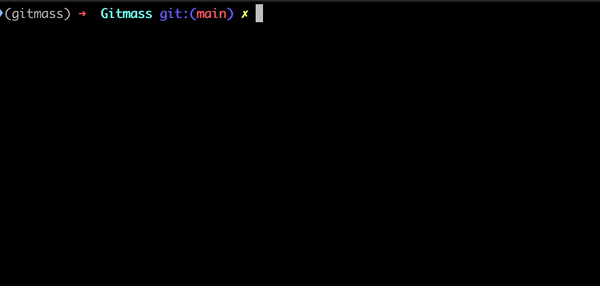

# GitMass
> Clone all your repositories with a single line of command

[](./CONTRIBUTING.md)
[](https://codecov.io/gh/zinan/gitmass)
[](https://travis-ci.com/zinan/gitmass)
[](https://opensource.org/licenses/MIT)

Gitmass is a fast, lightweight and simple `bulk git clone tool`. You can clone and/or pull all your repositories in your organization. Works with Github, Gitlab and Bitbucket!

Bulk clones or pulls repositories in the given local directory. 



## Installation

Get the latest version:

```sh
git clone https://github.com/zinan/gitmass.git
```

installing requirements and seting up

```sh
make init
```

For Help:

```sh
make help
```
## Usage example

Simply run `gitmass.py` from terminal.

```sh
sudo chmod +x gitmass.py
./gitmass.py
```

If none of the parameters have been given, Gitmass asks you necessary parameters when needed; like `url` of your vcs.
If you would like to define all parameters at first, keep reading.

`--url`: The URL of your VCS

`--org`: The Organization or Namespace

`--dir`: The directory where the repositories will be cloned in

`--token`: Private token (will be obsolete if username and password given)

`--user`: Username (Mandatory for Bitbucket only)

For example:

```sh
./gitmass.py --url https://github.com --dir /path/to/foo/bar --org myorganization --token 1010100101010010101001010010
```

## Release History

* 0.1.0
    * The first proper release

## Meta

Sinan Turgut – [@zinan](https://twitter.com/zinaney) – mail@sinanturgut.com

Distributed under the MIT license. See ``LICENSE`` for more information.

[https://github.com/zinan/gitmass](https://github.com/zinan/gitmass)

## Contributing

[CONTRIBUTING GUIDE](./docs/CONTRIBUTING.md)
